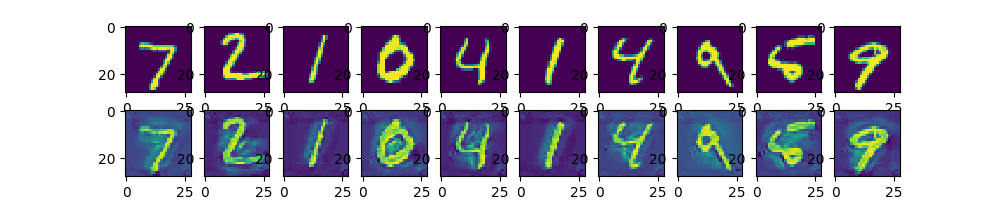

# Adversarial Transformation Network(ATN)

## Introduction

  A simple implement of an Adversarial Autoencoding ATN(AAE ATN) proposed in [Adversarial Transformation Networks: Learning to Generate Adversarial Examples](https://arxiv.org/abs/1703.09387)


## Usage

  You can test with my trained model:

  ```shell
  python atn.py
  ```

  If you want to train by yourself:
  ```shell
  python atn.py --train
  ```

## Result

  Here are some visualized samples:

  

  Before attack, the accuracy of the target cnn network is **0.9902**, and it becomes **0.4756** after attack.

  The result is not good enough, so **WELCOME CONTRIBUTION !!!**
